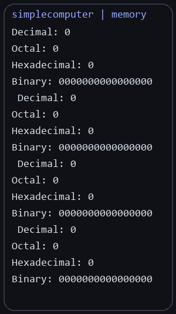
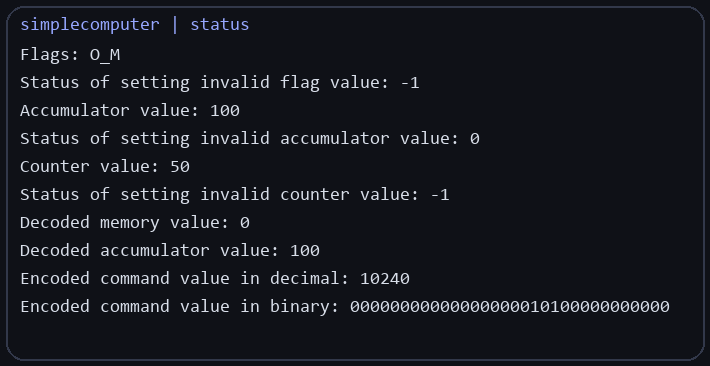

# simplecomputer

Educational simple computer project in C with terminal utilities, an assembler, and supporting modules.

## Overview

This repository contains a training project that simulates a simple computer environment and includes terminal helpers, input utilities, large-character rendering, and an assembler.

## Screenshots

These screenshots were captured from a real Linux terminal run of the project.

## Structure

- `mySimpleComputer` - core simple computer module
- `myTerm` - terminal utilities
- `myReadKey` - keyboard input helpers
- `myBigChars` - big character rendering
- `simpleassembler` - assembler-related functionality
- `include` - shared headers

## Stack

C, Makefile.

## Notes

This project was developed as part of coursework and practical assignments in systems programming.
